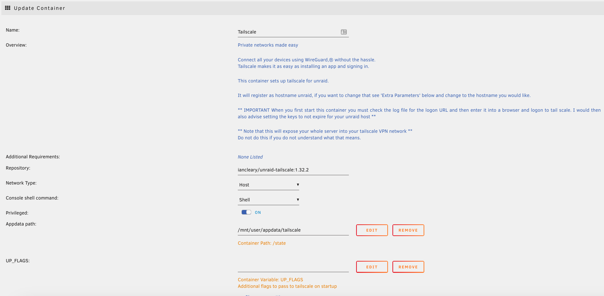
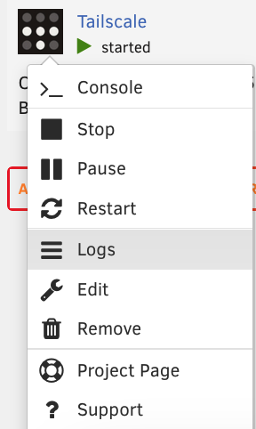

# unraid-tailscale

Docker build files for tailscale on unraid


This is intentended to provide access to the unraid server itself over tailscale and does not act as a VPN gateway.

It is possible to get this working using UP_FLAGS however as this was never the intention for this container I cannot provide
support for this usage.

## Instructions

First off, the use of my image relies  on the template for unraid community applications from <https://github.com/deasmi/unraid-tailscale>. I currently don't know how to make these templates.  Simply change the image to:

`iancleary/unraid-tailscale:TAG` with a tag for matching the badge below.


If it were `1.36.2`, the image would be `iancleary/unraid-tailscale:1.36.2`.

----



** IMPORTANT When you first start this container you must check the log file for the logon URL and then enter it into a browser and logon to tail scale. I would then also advise setting the keys to not expire for your unraid host **



## Optional Env Vars

- `UP_FLAGS` &ndash; Pass flags to the `tailscale up` command run on start-up
Please note that support cannot be provided for the use of UP_FLAGS


## Workflow to build image

### Production

> Update .env and README.md with version of tailscale package

```bash
just change old-version new-version
```

> Build and Push to Docker Hub

```
docker login -u iancleary
just build
just push
```

## Authors

See [Authors.md](Authors.md) for LICENSE attributions.
